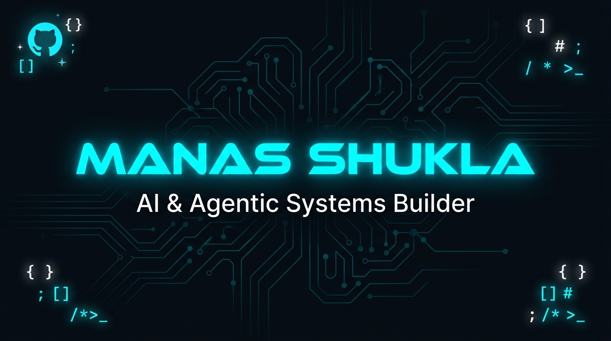
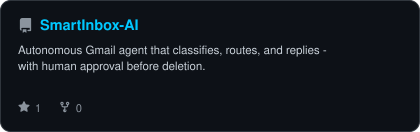
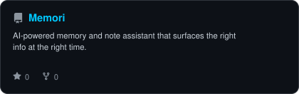

<div align="center">



<br/>

[](https://git.io/typing-svg)

<br/>

<a href="https://manas-shukla-portfolio.framer.website"></a>
<a href="https://linkedin.com/in/manas-shukla-006774370"></a>
<a href="mailto:shuklamanas89282@gmail.com"></a>
<a href="https://github.com/manas-shukla-101"></a>

<br/><br/>


</div>

---

## `whoami`

```python
class Manas:
    name       = "Manas Shukla"
    role       = "AI & Agentic Systems Builder"
    location   = "Mumbai, India 🇮🇳"
    education  = "Final Year B.E. — Computer Engineering"
    focus      = ["Agentic AI", "Multi-Modal Systems", "Data Science", "MLOps"]
    building   = "Memori — AI-powered memory assistant"
    open_to    = ["Internships", "Research Collaborations", "Freelance AI Projects"]
    fun_fact   = "I make LLMs argue with each other until they produce good science 🧪"
```

<div align="center">

| 🤖 What I Do | 🛠️ How I Do It | 🎯 What I Aim For |
|:---:|:---:|:---:|
| Build AI agents that route, classify & reply | Python · FastAPI · LangChain · n8n | Systems that run without babysitting |
| Turn raw data into decisions | Pandas · Gemini · XGBoost · Power BI | Insights in one click, not one week |
| Design multi-agent pipelines | Groq · OpenAI · LangFlow | Agents that debate, critique & self-improve |

</div>

---

## 📊 GitHub Stats

<div align="center">


</div>

<div align="center">


</div>

---

## 🏆 Achievements

<!-- Generated by metrics.yml workflow (METRICS_TOKEN required) -->

<div align="center">

<picture>
  <source media="(prefers-color-scheme: dark)" srcset="assets/metrics.achievements.svg">
  <source media="(prefers-color-scheme: light)" srcset="assets/metrics.achievements.svg">
  
</picture>

</div>

---

## 🧰 Tech Stack

<div align="center">

**AI / ML**


**Backend & APIs**


**Data & Automation**


</div>

<br/>

<div align="center">


</div>

---

## 📡 Skill Radar

<!-- Generated by: python scripts/radar.py --data assets/skills.json -o assets/radar -->
<!-- AND:          python scripts/radar.py --github manas-shukla-101 -o assets/radar-langs --limit 7 --values --curve 0.4 --exclude "shell,makefile,dockerfile,batchfile,procfile" -->

<table><tr>
<td width="50%" align="center">

**Self-rated**

<picture>
  <source media="(prefers-color-scheme: dark)" srcset="assets/radar-dark.svg">
  <source media="(prefers-color-scheme: light)" srcset="assets/radar-light.svg">
  
</picture>

</td>
<td width="50%" align="center">

**From the repos**

<picture>
  <source media="(prefers-color-scheme: dark)" srcset="assets/radar-langs-dark.svg">
  <source media="(prefers-color-scheme: light)" srcset="assets/radar-langs-light.svg">
  
</picture>

</td>
</tr></table>

---

## 🗂️ Featured Projects

<!-- Generated by: python scripts/cards.py --user manas-shukla-101 --out assets -->

<table><tr>
<td width="50%">
<a href="https://github.com/manas-shukla-101/HireSight-AI">
<picture>
  <source media="(prefers-color-scheme: dark)" srcset="assets/card-HireSight-AI-dark.svg">
  <source media="(prefers-color-scheme: light)" srcset="assets/card-HireSight-AI-light.svg">
  
</picture>
</a>
</td>
<td width="50%">
<a href="https://github.com/manas-shukla-101/AI-Data-Analyst-Agent">
<picture>
  <source media="(prefers-color-scheme: dark)" srcset="assets/card-AI-Data-Analyst-Agent-dark.svg">
  <source media="(prefers-color-scheme: light)" srcset="assets/card-AI-Data-Analyst-Agent-light.svg">
  
</picture>
</a>
</td>
</tr><tr>
<td width="50%">
<a href="https://github.com/manas-shukla-101/SmartInbox-AI">
<picture>
  <source media="(prefers-color-scheme: dark)" srcset="assets/card-SmartInbox-AI-dark.svg">
  <source media="(prefers-color-scheme: light)" srcset="assets/card-SmartInbox-AI-light.svg">
  
</picture>
</a>
</td>
<td width="50%">
<a href="https://github.com/manas-shukla-101/Memori">
<picture>
  <source media="(prefers-color-scheme: dark)" srcset="assets/card-Memori-dark.svg">
  <source media="(prefers-color-scheme: light)" srcset="assets/card-Memori-light.svg">
  
</picture>
</a>
</td>
</tr></table>

<div align="center"><sub>

| Project | Stack | Highlights |
|---|---|---|
| **HireSight AI** | Flask · spaCy · Sentence-Transformers · SQLite | Semantic JD↔Resume matching · skill-gap PDF reports |
| **AI Data Analyst Agent** | FastAPI · Gemini AI · n8n · Pandas | Full EDA pipeline · natural-language data Q&A |
| **SmartInbox AI** | GPT-4o · LangFlow · n8n · Gmail API | Auto-classify, route & reply · human-in-the-loop deletion |
| **Memori** | Python · AI APIs | Context-aware memory that surfaces the right info |

</sub></div>

---

## 📅 Coding Activity

<!-- Generated by metrics.yml workflow -->

<div align="center">

<picture>
  <source media="(prefers-color-scheme: dark)" srcset="assets/metrics.isocalendar.svg">
  <source media="(prefers-color-scheme: light)" srcset="assets/metrics.isocalendar.svg">
  
</picture>

</div>

---

## 🐍 Contribution Snake

<div align="center">

<picture>
  <source media="(prefers-color-scheme: dark)" srcset="https://raw.githubusercontent.com/manas-shukla-101/manas-shukla-101/output/snake-dark.svg">
  <source media="(prefers-color-scheme: light)" srcset="https://raw.githubusercontent.com/manas-shukla-101/manas-shukla-101/output/snake.svg">
  
</picture>

</div>

---

## 🎯 Currently Focused On

```text
🔬 Agentic System Design     ████████████░░░   Building multi-agent debate frameworks
🧠 Multi-Modal AI Evaluation ██████████░░░░░   RAG + vision + structured output pipelines
📊 Production MLOps          ████████░░░░░░░   FastAPI · Docker · GitHub Actions
📚 Final Year Research       ██████░░░░░░░░░   Computer Vision + LLM hybrid systems
```

---

<div align="center">

**Let's build something that matters.**

<a href="mailto:shuklamanas89282@gmail.com"></a>
<a href="https://manas-shukla-portfolio.framer.website"></a>
<a href="https://linkedin.com/in/manas-shukla-006774370"></a>

<br/><br/>


</div>
