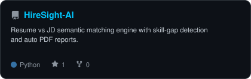
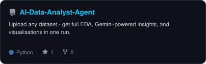
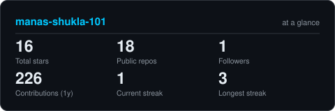

  
  
  

---

  <h2>👾 INTERACTIVE GUESTBOOK 👾</h2>
  
Leave your mark on my profile! Click the button below, submit the issue without changing the title, and GitHub Actions will automatically add your avatar here.

  
  
  
    

  

<!-- GUESTBOOK_START -->
<!-- GUESTBOOK_END -->
  

---

<table align="center" width="100%" style="border-collapse: collapse; border: none;">
<tr>
<td width="50%" align="center" style="border: none;">
  <h3>🚀 TOP PROJECTS</h3>
<a href="https://github.com/manas-shukla-101/HireSight-AI">
<picture>
  <source media="(prefers-color-scheme: dark)" srcset="assets/card-HireSight-AI-dark.svg">
  <source media="(prefers-color-scheme: light)" srcset="assets/card-HireSight-AI-light.svg">
  
</picture>
</a>
 
<a href="https://github.com/manas-shukla-101/AI-Data-Analyst-Agent">
<picture>
  <source media="(prefers-color-scheme: dark)" srcset="assets/card-AI-Data-Analyst-Agent-dark.svg">
  <source media="(prefers-color-scheme: light)" srcset="assets/card-AI-Data-Analyst-Agent-light.svg">
  
</picture>
</a>
</td>
<td width="50%" align="center" style="border: none;">
  <h3>📊 ANALYTICS</h3>
<picture>
  <source media="(prefers-color-scheme: dark)" srcset="assets/card-stats-dark.svg">
  <source media="(prefers-color-scheme: light)" srcset="assets/card-stats-light.svg">
  
</picture>
 
<picture>
  <source media="(prefers-color-scheme: dark)" srcset="assets/radar-langs-dark.svg">
  <source media="(prefers-color-scheme: light)" srcset="assets/radar-langs-light.svg">
  
</picture>
</td>
</tr>
</table>

---

  <h2>🌍 GLOBAL ACTIVITY</h2>

<picture>
  <source media="(prefers-color-scheme: dark)" srcset="https://raw.githubusercontent.com/manas-shukla-101/manas-shukla-101/output/snake-dark.svg">
  <source media="(prefers-color-scheme: light)" srcset="https://raw.githubusercontent.com/manas-shukla-101/manas-shukla-101/output/snake.svg">
  
</picture>

---

  <h3>⚡ TECHNOLOGY ARSENAL</h3>
  

 

  

