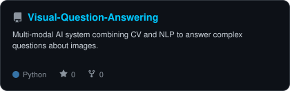

<div align="center">

<picture>
  
</picture>

</div>


---

<div align="center">
  <h2>🚀 TERMINAL MISSION CONTROL</h2>
</div>

```bash
manas@quantum-node:~$ ./init_session --user visitor
[SYSTEM READY] Connecting to Manas Shukla's Neural Cluster...

❯ BIO:          Autonomous AI Systems Architect & Machine Learning Engineer
❯ LOCATION:     Pune, India 🇮🇳
❯ SPECIALTY:    Multi-Agent Orchestration, Multimodal Vision-Language, LLM Tool-Use
❯ PORTFOLIO:    https://manas-shukla-portfolio.framer.website
❯ LINKEDIN:     https://linkedin.com/in/manas-shukla-006774370
❯ EMAIL:        shuklamanas89282@gmail.com
❯ STATUS:       Open for High-Impact Roles & Research Collaborations
```

---

<div align="center">
  <h2>🧠 ELITE PROJECT ARCHITECTURE</h2>
</div>

<table align="center" width="100%" style="border-collapse: collapse; border: none;">
<tr>
<td width="50%" align="center" style="border: none;">
<a href="https://github.com/manas-shukla-101/HireSight-AI">
<picture>
  <source media="(prefers-color-scheme: dark)" srcset="assets/card-HireSight-AI-dark.svg">
  <source media="(prefers-color-scheme: light)" srcset="assets/card-HireSight-AI-light.svg">
  
</picture>
</a>
</td>
<td width="50%" align="center" style="border: none;">
<a href="https://github.com/manas-shukla-101/AI-Data-Analyst-Agent">
<picture>
  <source media="(prefers-color-scheme: dark)" srcset="assets/card-AI-Data-Analyst-Agent-dark.svg">
  <source media="(prefers-color-scheme: light)" srcset="assets/card-AI-Data-Analyst-Agent-light.svg">
  
</picture>
</a>
</td>
</tr>
<tr>
<td width="50%" align="center" style="border: none;">
<br>
<a href="https://github.com/manas-shukla-101/SmartInbox-AI">
<picture>
  <source media="(prefers-color-scheme: dark)" srcset="assets/card-SmartInbox-AI-dark.svg">
  <source media="(prefers-color-scheme: light)" srcset="assets/card-SmartInbox-AI-light.svg">
  
</picture>
</a>
</td>
<td width="50%" align="center" style="border: none;">
<br>
<a href="https://github.com/manas-shukla-101/Visual-Question-Answering">
<picture>
  <source media="(prefers-color-scheme: dark)" srcset="assets/card-Visual-Question-Answering-dark.svg">
  <source media="(prefers-color-scheme: light)" srcset="assets/card-Visual-Question-Answering-light.svg">
  
</picture>
</a>
</td>
</tr>
</table>

---

<table align="center" width="100%" style="border-collapse: collapse; border: none;">
<tr>
<td width="50%" align="center" style="border: none;">
  <h3>📊 ANALYTICS</h3>
<picture>
  <source media="(prefers-color-scheme: dark)" srcset="assets/card-stats-dark.svg">
  <source media="(prefers-color-scheme: light)" srcset="assets/card-stats-light.svg">
  
</picture>
<br><br>
<picture>
  <source media="(prefers-color-scheme: dark)" srcset="assets/radar-langs-dark.svg">
  <source media="(prefers-color-scheme: light)" srcset="assets/radar-langs-light.svg">
  
</picture>
</td>
<td width="50%" align="center" style="border: none;">
  <h3>⚡ TECH ARSENAL</h3>
  
  <br>
  
  **🧠 Core AI & Vision**<br>
  
  
  
  
  
  
  <br><br>
  **⚡ Agentic & LLMs**<br>
  
  
  
  
  
  <br><br>
  **🚀 Backend & Data**<br>
  
  
  
  

  <br><br>
  **🛠️ DevOps & Arch**<br>
  
  
  
</td>
</tr>
</table>

---

<div align="center">
  <h2>🌍 GLOBAL ACTIVITY</h2>
</div>

<picture>
  <source media="(prefers-color-scheme: dark)" srcset="https://raw.githubusercontent.com/manas-shukla-101/manas-shukla-101/output/snake-dark.svg">
  <source media="(prefers-color-scheme: light)" srcset="https://raw.githubusercontent.com/manas-shukla-101/manas-shukla-101/output/snake.svg">
  
</picture>

<br>

<div align="center">
  
</div>
